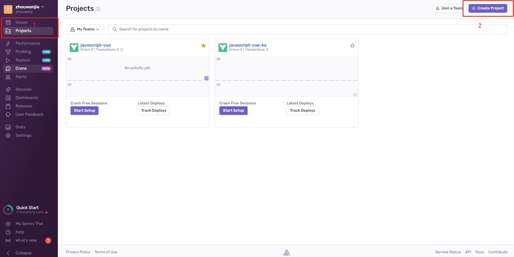
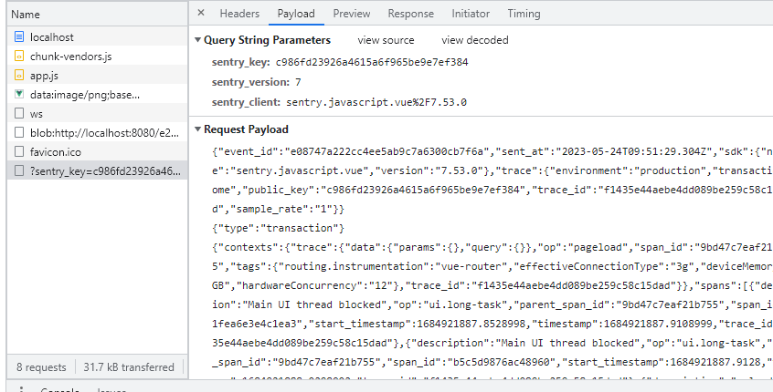

# sentry使用笔记

## 配置

    之前在掘金上或者百度上说是可以通过sentry提供的本地搭建工具进行本地化接受错误，onpremise或者self-hosted
    但是使用的时候需要安装docker，python3安装完之后执行./install.sh配置账号密码的时候，命令行直接弹出一下就消失了
    搜索是说sh是linux上的命令在windows无法执行，然后可以使用git bash去执行./install.sh
    在使用了git bash之后，提示

    Seems like you are using an MSYS2-based system (such as Git Bash) which is not supported. Please use WSL instead

    感觉搞来搞去太麻烦了，索性直接挂加速器使用官方服务器

    注册登录进去之后先点击1的project，然后点击2的create project，创建一个新的项目

    之后按照提示，安装依赖，并配置sentry，此时会有个dsn，这个是每个项目都不一样的，配置完成之后进行一次测试

    接收到错误了，配置成功了

    注意：sentry接收到错误之后通过network请求向服务器发送数据

    在Sentry.init执行前产生的错误并不会进行上报
    
## @sentry/cli安装失败

    上传sourcemap源码时，可以使用@sentry/cli上传或者使用插件@sentry/webpack-plugin进行自动化上传，但实际实验过程中，@sentry/cli使用npm，cnpm，yarn始终安装不了，nvm切换过node版本也无效，查了很多资料试了很多方法也无法安装