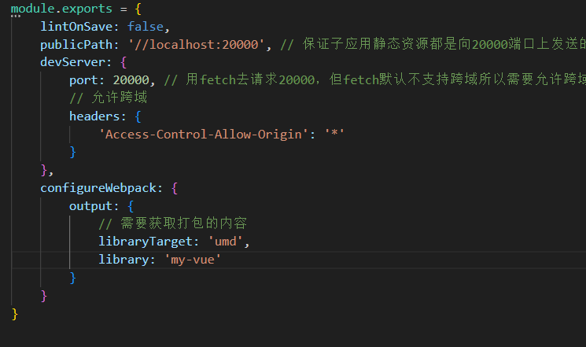
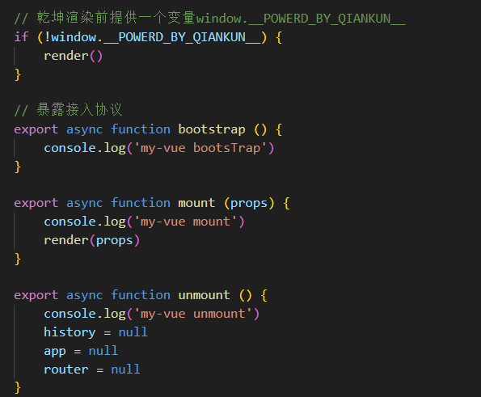

# qiankun使用笔记

## base基座应用

    在基座应用base中，需要进行以下配置，安装qiankun依赖，调用registerMicroApps函数注册子应用，再通过start函数进行启动

## vue3项目

vue3项目中，进行以下配置：

    vue.config.js:

    首先在路由文件中，将routes输出

    为什么要这么做呢，因为在基座应用中，子应用之间是通过不同的url来进行切换，比如注册中my-vue的activeRule是'/vue'，那么my-vue在基座应用中访问的实际地址就应该是从http://localhost:3000/vue#/开始，调用createWebHashHistory组成修改后的router，然后再将页面挂载到传入的container元素中
    main.js

    main.js
    接下来是创建生命周期，暴露给基座应用

## react项目

    .rescriptsrc.js
    

    .env

    index.js

    package.json

### react项目中遇到的一些问题

    可能是对react不熟练导致的
    1.最开始创建的react项目使用的是react18，在index.js的ReactDOM.render报错。原因是react18已不支持这种写法，改为
    const root = createRoot('container')
    root.render(<App />)

    2.通过rescriptsrc打包，修改package.json为"start": "rescripts start"，提示rescripts不是可执行的程序，安装@rescripts/cli
    继续执行，报Failed to decode param '/%PUBLIC_URL%/favicon.ico'，可能是由于版本引起的问题

    3.页面html能获取到，但是提示没有生命周期函数，图片获取异常

    最后使用了跟网上一样的react17版本，@rescripts/cli：^0.0.16"

## 使用总结

    1.子应用中需要配置静态资源地址publicPath供基座应用调用，且需要允许跨域，基座应用通过fetch获取html
    2.子应用中还需要配置打包类型为umd
    2.基座应用中要对子应用进行注册，包括name匹配子应用打包的libiary，entry匹配子应用的publicPath获取静态资源，container为子应用页面挂载在基座应用上的元素，activeRule为该子应用在基座应用上对应的URL

    问题：如何在一个页面渲染多个子应用，类似大屏效果

## qiankun的一些原理

    node_modules中的模块，查看registerMicroApps方法

    因为被babel转码过，所以不太好阅读，直接去git把项目拉下来（https://github.com/umijs/qiankun.git）
    再查看registerMicroApps方法，替换掉node_modules里面的registerMicroApps方法

    可以看出registerMicroApps->获取没有注册过的Apps->遍历执行registerApplication

    再看start方法，用源码中的方法图换掉node_modules里面的start方法

    autoDowngradeForLowVersionBrowser方法，同样进行替换

    

## 样式隔离

    

## JS沙箱